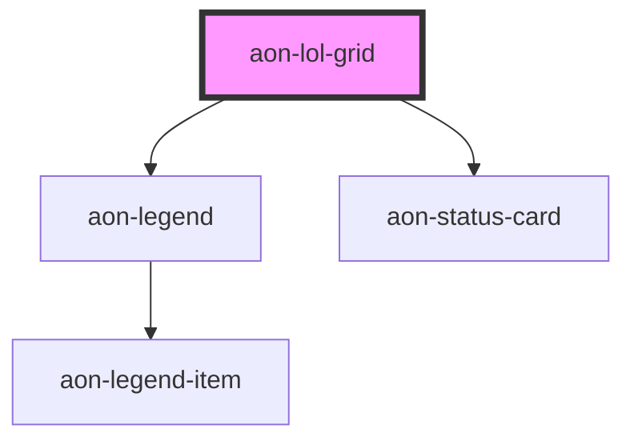

# my-component

<!-- Auto Generated Below -->

## Properties

| Property                  | Attribute | Description | Type            | Default     |
| ------------------------- | --------- | ----------- | --------------- | ----------- |
| `data` _(required)_       | --        |             | `IGridData[]`   | `undefined` |
| `legendData` _(required)_ | --        |             | `ILegendData[]` | `undefined` |

## Dependencies

### Depends on

- [aon-legend](../aon-legend)
- [aon-status-card](../aon-status-card)

### Graph

----------------------------------------------

*Built with [StencilJS](https://stenciljs.com/)*
